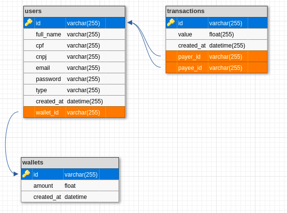
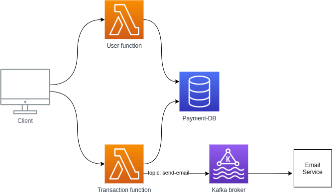

# **Payment-service**

O projeto consiste na criação de usuários comuns/logistas, podendo realizar transferências de usuários comuns para logistas.

Principios/Técnicas/Conceitos utilizados:
- **Clean Architecture (CA)**
- **Domain-Driven Design (DDD)**
- **SOLID**
- **Design Patterns**
- **Keep It Simple, Stupid (KISS)**
- **Don't Repeat Yourself (DRY)**


## **Instruções de instalação**

### Começando

#### 1) Clone & Instalar Dependências

- 1.1) `git clone https://github.com/ricardoSpara/payment-service.git`
- 1.2) `cd payment-service` - cd em seu diretório de projeto recém-criado
- 1.3) `cp .env.development.example .env` - copiar variáveis ​​de ambiente.
  **Note:** verifique as variáveis ​​de ambiente de acordo com suas configurações locais (no .example está de acordo com docker-composer já)

#### 2) Inicie a aplicação

- 2.1) **[Docker]** Se você tiver uma docker em sua máquina:
  - 2.1.1) Local Deploy: `docker-compose up`


## **Aplicação**

### Rotas

Foi utilizado swagger para documentar as rotas da aplicação, verifique `http://localhost:3000/api-docs/`

### Modelagem de dados

Foi utilizado PostgreSQL e consiste em 3 tabelas como na imagem a seguir:



### Arquitetura atual

Hoje temos uma arquitetura monolítica muito simples. onde temos uma unica aplicacao que e reponsavel por criar usuários e realizar transferências.


### Arquitetura sugerida

Conseguimos evoluir para uma arquitetura serverless, onde separamos a parte de usuário (user/wallet) e transações (Transactions), dessa forma a arquitetura continua simples, mas conseguimos escalar por demanda, exemplo: pode ser que nao criamos usuários com tanta recorrencia e com isso nao a neccecidade de escalar infraestrutura para usuários, por outro lado transações tem muita recorrencia e com isso podemos escalar separadamente.


> - **email-service**: Separei a parte de envio de e-mail em um outro serviço pois na minha visão não é uma tarefa que precisa ser feita de forma síncrona, além disso, as arquiteturas serverless de provedores geralmente cobram por tempo que a função fica em execução.
> - **Kafka broker**: Utilizaria um broker como o kafka para mensageria da arquitetura (também poderia ser um RabbitMQ). Toda vez que precisássemos enviar um e-mail, madarariamos para um uma mensagem para o topico send-email, e teriamos o email-service consumindo essas mensagens.



## **Testes**

Os teste utilizam jest, foquei os testes principalmente na parte de caso de uso, onde ficam todas as implementações. Automaticamente já é gerado a pasta coverge para verificar quais pontos do sistemas estão testados.

### Rodar

```bash
yarn test # or npm run test
```


